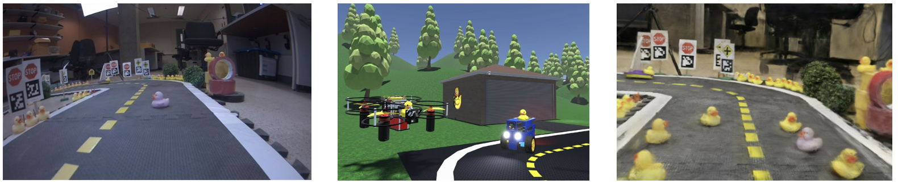
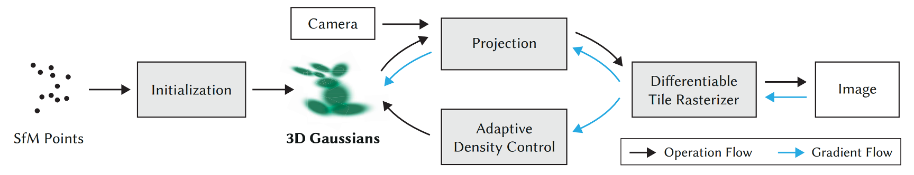
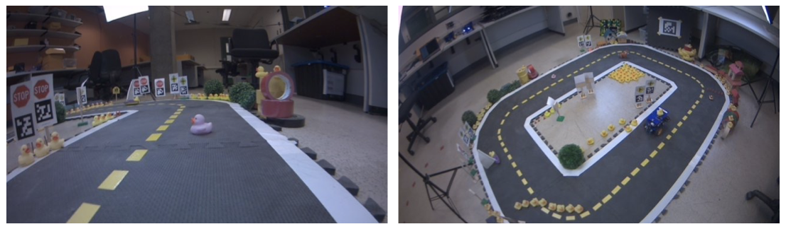
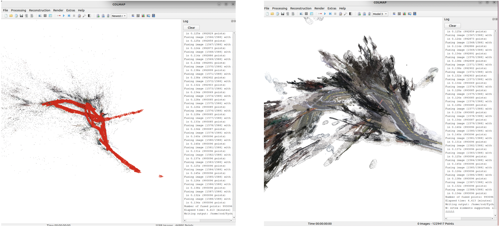
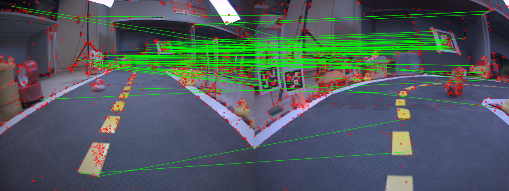

# DuckieSplat: A Data-Driven Simulator for Duckietown

Interactive DuckieSplat Demo: https://rdesc.dev/duckiesplat

## Introduction 

Autonomous vehicles (AVs) are revolutionizing modern transportation, with Level 4 [1] self-driving vehicles becoming an increasingly regular presence on US roads. Despite this progress, ensuring the operational safety of AVs in safety-critical scenarios, such as adverse weather conditions or unexpected agent behaviours, remains a significant obstacle to the scalable adoption of self-driving technology. Simulation has emerged as a promising tool to improve coverage over the interesting, safety-critical distribution of driving scenarios, which can be used either for the training or evaluation of autonomous vehicles. 

The supported simulator for Duckietown is the Duckiematrix, which is created in Unity and relies on handcrafted assets to construct virtual environments for testing Duckiebots. This approach to simulation is similar to traditional driving simulators such as CARLA [2], which are handcrafted and thus rely on costly manual labour to create simulation environments. Consequently, these handcrafted environments are difficult to scale to novel environments and suffer from a significant sim-to-real gap. We illustrate the sim-to-real *appearance* gap in Figure 1. To address these limitations of handcrafted simulators, recent works have instead focused on *data-driven* simulation, whereby collected real-world driving data can be leveraged to derive simulation environments, either by training a generative model to sample from the distribution of such data [3], or by employing novel view synthesis techniques to reconstruct 3D environments of the data [4-5]. 

|  |
|:--:|
| Figure 1: **Data-driven simulators exhibit smaller visual sim-to-real gap than handcrafted simulators.** *Left*: Real image of Duckietown track in the lab. *Middle*: Rendered image of simulated Duckietown track in the Duckiematrix. *Right*: Rendered image of simulated Duckietown track in DuckieSplat. |

This project focuses specifically on utilizing a data-driven novel view synthesis technique known as 3D Gaussian Splatting [6] to synthesize a 3D virtual simulation environment for Duckiebots. Due to time constraints, we focus specifically on simulating realistic camera data of the physical Duckietown track in the lab. To this end, we propose **DuckieSplat**, a data-driven simulator for Duckietown based on 3D Gaussian Splatting that can simulate realistic RGB camera data of the physical Duckietown track *in real-time* (60 FPS). Figure 1 (right) shows a rendered view in the DuckieSplat simulator, which exhibits a visually smaller sim-to-real gap compared to the handcrafted Duckiematrix simulator. In the following section, we provide a concise introduction to 3D Gaussian Splatting followed by an overview of DuckieSplat.

## DuckieSplat

This section outlines the 3D Gaussian Splatting algorithm, which leverages data for *novel view synthesis*. Novel view synthesis methods use a small set of 2D input observations of a *specific static scene* to recover its underlying 3D representation. These learned representations enable rendering novel views of the static scene, making them particularly useful for the sensor simulation application. In this project, the specific scene we choose to reconstruct is the physical Duckietown track in the lab. It is important to note in a typical 3D Gaussian Splatting pipline, the scene must be *static*; however, most driving scenes contain static (e.g., background) and dynamic (e.g., duckies) components. In this work, we assume that the full scene is static, and we leave separate modelling of static and dynamic components, for example as done in [4-5], for future work. Inconsistencies in the static scenes between images, for example Figure 1 (Left) contains fewer duckies than Figure 1 (Right), can cause issues for the 3D Gaussian Splatting. We therefore ensure that all collected images for Gaussian Splat training are of the same static scene. Notably, the image in Figure 1 (left) was not used to train the Gaussian Splat that rendered Figure 1 (right), as it contained fewer duckies than the rendered scene.

**Radiance Fields**: 3D Gaussian Splatting falls under a class of methods that learn a *radiance field*. A radiance field is a function $F(\mathbf{x}, \mathbf{d}) = (\mathbf{c}, \sigma)$, where $\mathbf{x} \in \mathbb{R}^3$ is a point in 3D space, $\mathbf{d} \in \mathbb{R}^3$ is a unit vector representing the viewing direction, $\mathbf{c} \in \mathbb{R}^3$ is the RGB colour at that point and direction, and $\sigma \in \mathbb{R}$ is the volume density at $\mathbf{x}$, which can be intuitively understood as the differential probability of a ray hitting a particle at location $\mathbf{x}$. A radiance field enables rendering novel views of a scene using techniques such as volume rendering or alpha blending. 3DGS uses an explicit representation of 3D geometry by modelling the radiance field with a discrete set of parameterized 3D Gaussians. This is in constrast to a related class of methods called Neural Radiance Fields (NeRFs) [7] that implicitly represent 3D geometry by parameterizing the radiance field with a neural network.

**3D Gaussian Splatting**: 3D Gaussian Splatting (3DGS) utilizes an explicit representation of a radiance field using a discrete set of parameterized 3D Gaussians. In Figure 2, we show the Gaussian Splatting pipeline. While prior work has highlighted the flexibility of 3D Gaussians as a primitive for 3D geometry representation [8], 3DGS is the first approach to leverage these primitives for *real-time* rasterization of complex scenes. A key innovation of 3DGS is its elimination of the computational bottleneck inherent in NeRFs, which require dense neural network evaluations along rays cast from each pixel to render a single image—making real-time applications impractical. Instead, 3DGS employs a gradient-based optimization framework that entirely avoids neural network components, resulting in significantly faster training and inference compared to NeRFs. The 3D Gaussian primitive used in 3DGS is defined as $G(\mathbf{x}) = e^{-\frac{1}{2}\mathbf{x}^T\Sigma^{-1}\mathbf{x}}$, where $\mathbf{x}$ represents a 3D spatial position and $\Sigma$ is the 3D covariance matrix. 3DGS parameterizes $\Sigma$ using a scale matrix $S$ and a rotation matrix $R$:  
```math
\Sigma = RS S^T R^T,
```
which guarantees that $\Sigma$ remains positive semi-definite. The scale parameters are optimized independently along each of the $x$, $y$, and $z$ dimensions, producing an *anisotropic* covariance matrix. This anisotropic parameterization offers greater flexibility in fitting 3D geometries compared to an isotropic covariance matrix. 

|  |
|:--:|
| Figure 2: **Gaussian Splatting Pipeline.** Gaussian Splatting starts from a sparse point cloud derived from COLMAP, which are used to initialize a set of 3D Gaussians. Given a camera view, the Gaussians are projected into 2D and rasterized efficiently with a differentiable tile rasterizer. The rendering process is fully differentiable, which enables updating the Gaussian parameters with gradient-based optimization.|

The 3D Gaussian Splatting (3DGS) pipeline begins with a Structure-from-Motion (SfM) algorithm, such as COLMAP, to estimate camera intrinsic and extrinsic parameters as well as a point cloud representing the approximate 3D geometry of the scene. This point cloud serves as the initialization for a set of 3D Gaussians, where each Gaussian is parameterized by its spatial position (*i.e.*, mean of the Gaussian), a 3D covariance matrix, an opacity value $\alpha$, and spherical harmonic coefficients that capture view-dependent color. During the rendering process, rays are cast into the scene, and the properties of 3D Gaussians intersected by each ray are retrieved. Standard $\alpha$-blending is applied along the ray to aggregate the contributions of the intersected Gaussians to derive the pixel’s RGB color. In practice, for each ray, once a target saturation is reached, the thread terminates. This efficient rendering mechanism ensures that the occluded or non-intersecting Gaussians are ignored.

The learning process in 3DGS parallels that of Neural Radiance Fields (NeRFs). Images are rendered from the ground-truth camera poses and regressed against corresponding ground-truth images to compute a reconstruction loss. The gradients of this loss are backpropagated through the rendering procedure to optimize the parameters of the 3D Gaussians. Importantly, the differentiability of the 3D-to-2D Gaussian projection and the proposed $\alpha$-blending rasterization process enables direct optimization of Gaussian parameters, without the need for any neural network components. This approach results in faster optimization and inference compared to NeRFs. The loss function utilized by 3DGS combines an L1 loss and a Structural Similarity Index Measure (SSIM) loss [9]:

```math
L = (1 - \lambda) L_1 + \lambda L_{\text{D-SSIM}}.
```

At the core of 3DGS is a *real-time* differentiable rasterization process, which allows for gradient-based optimization of the 3D Gaussian parameters. To achieve this, 3DGS bins the Gaussians into $16 \times 16$ spatial tiles, where the Gaussians in each tile are sorted by depth in parallel on a GPU using Radix sort. A separate thread is launched for each pixel to cast rays into the scene. These threads retrieve intersecting Gaussians, sorted by depth on a per-tile basis, and accumulate their contributions via $\alpha$-blending. Once a target saturation $\alpha$ is reached, the thread terminates, ensuring efficient computation. This parallelized approach drastically improves rendering speed, enabling real-time rasterization. 3DGS additionally contains an adaptive density control block that clones Gaussians with large positional gradients, and remove Gaussians with low $\alpha$ values at fixed intervals during training. 3DGS represents a significant advancement in the field of 3D computer vision, effectively replacing NeRFs as the state-of-the-art technique for novel view synthesis. Its explicit 3D representation is not only faster and more efficient but also more interpretable and easily controllable. These characteristics make 3DGS particularly well-suited for applications such as data-driven simulation, where the ability to manipulate and understand the underlying representation is critical.

**DuckieSplat**: In this project, we utilize the official 3DGS repository to train a Gaussian Splat that can reconstruct the physical Duckietown track in the lab. We call the trained Gaussian Splat **DuckieSplat**. We first require a set of images of the track that can be used to train DuckieSplat. We experiment with images collected from two types of sensors: the Duckiebot camera and an iPhone camera. For each sensor, we also experiment with two image collection protocols. The first protocol involves manually collecting images with a Duckiebot (or iPhone that is approximately positioned at the height of a Duckiebot) as it completes one loop of the track. The second protocol involves collecting images from an overhead view, where we manually hold the Duckiebot (or iPhone camera) roughly 1.5m above the track and collect images at fixed intervals while walking once around the outside of the track. Figure 3 shows an example of a collected image following the first protocol (Figure 3, Left) and second protocol (Figure 3, Right). 

|  |
|:--:|
| Figure 3: **Image collection protocols.** *Left*: Duckiebot view. *Right*: Overhead view.|

Given a set of images collected using one of the two sensors and one (or both) of the image collection protocols, we first run COLMAP to attain approximate camera extrinsic and intrinsic parameters as well as a sparse point cloud of the approximate 3D geometry. We then train DuckieSplat using the official 3DGS repository with default settings. Depending on the set of images used for training, COLMAP takes between 1-2 hours to run and 3DGS training takes approximately 30 minutes.

Once training is complete, we can interact with DuckieSplat in a web browser: https://rdesc.dev/duckiesplat. By default, DuckieSplat will render camera views from an (approximate) Duckiebot view as it drives along the centerline around the track in an infinite loop. Pressing the keyboard will break the infinite loop and allow a user to manually interact with DuckieSplat using keyboard control. We created the infinite loop by manually collecting a sequence of camera views (defined by a quaternion $q$ and translation vector $t$) while manually "driving" along the track inside DuckieSplat using keyboard control. We then interpolate the views using a simple linear interpolation scheme, where we use linear interpolation of the translation vectors and slerp interpolation of the rotations parameterized as quaternions:

```math
t_{\alpha} = (1 - \alpha) t_1 + \alpha t_2, \\
q_{\alpha} = (q_1 q_0^{-1})^{\alpha}q_0, \alpha \in [0, 1].
```

In the next section, we walk through the results of DuckieSplat using the different sensors and image collection protocols, while describing the technical issues we faced in producing a high-quality reconstruction of the Duckietown track.

## Results
We successfully trained DuckieSplat using images collected with the iPhone camera using both the Duckiebot view and overhead view image collection protocols. We provide several qualitative results and discuss our failure cases below. The demo of DuckieSplat can be accessed at https://rdesc.dev/duckiesplat.

Visually, the scene is reconstructed well, with the track, duckies, road signs, and other objects in the lab being clearly visible. There are however some artifacts in the reconstruction, such as the road not having a completely flat appearance when viewing the track at ground level. The 'shard'-like appearance of the individual splats are also visible in parts of the reconstruction. Such artifacts can likely be minimized by collecting a larger variety of images and ensuring the environment does not change during image collection.
### Gaussian Splat Training Progress
The following two animations illustrate training progress, where the quality of the reconstructed image progressively improves as training progresses.

|  |  |
|:---------------------------------------------------:|:---------------------------------------------------:|


### Comparing the sparse point cloud with the 3DGS output
Here we show a comparison between the sparse point cloud generated by COLMAP and the output from 3DGS. 

https://github.com/user-attachments/assets/825c1135-e759-4ded-9fb8-f85363310006

### COLMAP Feature Matching
Feature matching is essential for COLMAP to find correspondences between images. In the following figure, we show a successful example of feature matching with a gold duckie which is a relatively small object in the environment but provides visually distinct images features. This example illustrates the importance of having high quality images in order to increase the accuracy of the feature matching process.

|                                                       |
|:-------------------------------------------------------------------------------------------------:|
| Figure 5: **Feature matching example in COLMAP.** *Left*: Duckiebot view. *Right*: Overhead view. |


### Failure Cases
### Duckiebot Camera with Only Overhead View Images
While this setup was able to generate a reasonable reconstruction of the Duckietown track, the quality of the reconstruction is insufficient when observing from the Duckiebot view. This is illustrated in the video below.

https://github.com/user-attachments/assets/4924b53f-308d-4707-91a7-9cca2fc82202

### Duckiebot Camera with Both Duckiebot and Overhead View Images
We were unable to successfully generate the sparse point cloud and camera poses using COLMAP with data collected with the Duckiebot camera with both Duckiebot view and overhead view images. 
Although we tried several different settings including changing the camera resolution, exposure, adding more visually distinct features to the environment, increasing the lighting, and moving the Duckiebot by hand to minimize motion blur, we were unable to generate a sparse point cloud with more than 2 images. We have several hypotheses for why this may have occurred, including the lack of visually distinct features in the environment particularly from the duckiebot view, and the motion blur caused by the Duckiebot's motion.

We highlight several snapshot to illustrate this failure case. In Figure 5 we visualize the poor reconstruction output from COLMAP. The large number of visually similar features in the Duckiebot view images (e.g., the yellow and white lane markings in Figure 6) likely contributed to the failure of COLMAP. 

|                                                                                            |
|:----------------------------------------------------------------------------------------------------------------------------------:|
| Figure 5: **Example of poor reconstruction** *Left*: Camera pose information. *Right*: Output from the Multi-View Stereo pipeline. |

|                                                                                   |
|:------------------------------------------------------------------------------------------------------------------------------:|
| Figure 6: **Example of feature matching**. The red points are the detected features while the green lines are feature matches. |


## How to Reproduce

### Setup and Installation[^1]
1. [Install CUDA 11.8 Compiler](#installing-cuda-118-compiler)
1. [Install COLMAP](#Installing-COLMAP)
2. [Install 3DGS](#Installing-3DGS)

### Generating a DuckieSplat
1. [Collect Data](#Collecting-data)
2. [Generate Dataset](#Generating-a-dataset)
2. [Run COLMAP](#Running-COLMAP)
3. [Train 3DGS](#Training-3DGS)
3. [Visualize 3DGS](#Visualizing-3DGS)

### Installing CUDA 11.8 Compiler
Check to see your current CUDA compiler version:
```shell    
nvcc --version
```
The 3DGS repo requires a specific version of the CUDA compiler. See the instructions for installing [CUDA compiler 11.8](https://developer.nvidia.com/cuda-11-8-0-download-archive?target_os=Linux&target_arch=x86_64&Distribution=Ubuntu&target_version=22.04&target_type=runfile_local).

Install the cuda-toolkit-gcc package:
```shell
sudo apt-get install nvidia-cuda-toolkit-gcc
```

### Installing COLMAP
Instructions to install COLMAP are found on the [documentation webpage](https://colmap.github.io/install.html#debian-ubuntu). Run the cmake command with the following flags:
```shell
cmake .. -GNinja -DCMAKE_CUDA_COMPILER=/usr/local/cuda-11.8/bin/nvcc -DCMAKE_CUDA_ARCHITECTURES=75
```
### Installing 3DGS
Instructions are found in the official github repository: https://github.com/graphdeco-inria/gaussian-splatting. 

For easy reference here are the main steps for installing 3DGS:
```shell
git clone https://github.com/graphdeco-inria/gaussian-splatting --recursive
conda env create --file environment.yml
conda activate gaussian_splatting
```

(Optional): It is useful to install the [optional interactive viewer](https://github.com/graphdeco-inria/gaussian-splatting?tab=readme-ov-file#interactive-viewers) for viewing the 3DGS and [tensorboard](https://pypi.org/project/tensorboard/) for monitoring training progress.

### Collecting Data
Although we failed to get COLMAP working with data collected with the Duckiebot camera, we describe our process here nonetheless.
We skip the details on how to collect data with the iPhone camera ;)

#### Increase the resolution of the Duckiebot camera
The default resolution of the Duckiebot camera is 640x480 pixels. This resolution is too low to capture sufficient image features for COLMAP to work effectively. We can increase the resolution of the Duckiebot camera by changing the camera settings on the Duckiebot. More details on the Duckiebot camera specs are found [here](https://www.waveshare.com/wiki/IMX219-160_Camera).

Edit the file `/data/config/node/camera_driver_front_center/$DUCKIEBOT_NAME.yaml` on the Duckiebot. There are three parameters of interest: res_h, res_w, and exposure. Set res_h and res_w to 1080 and 1920, respectively, and set exposure to 13000. The updated file should look like this:
```yaml
allow_partial_fov: false
exposure: 13000
exposure_mode: sports
fov: 160
framerate: 30
maker: Seeed Technology Co., Ltd
model: IMX219
res_h: 1080
res_w: 1920
rotation: 0
use_hw_acceleration: true
```
**NOTE**: Changing the camera settings requires camera calibration for the new camera intrinsics!

Next, restart the camera-related docker containers:
```shell
docker -H donald.local restart ros1-camera driver-camera
```
The duckiebot camera should now be set to 1080x1920 resolution.

#### Collecting images with the Duckiebot camera
Exec into one of the ros containers on the duckiebot:
```shell
docker -H $DUCKIEBOT_NAME.local exec -it $ROS_CONTAINER_ID bash
```
Now, run the image saver node which saves images from the camera to the `/duckiebot_images` directory:
```shell
rosrun image_view image_saver image:=/$DUCKIEBOT_NAME/camera_node/image _image_transport:=compressed _filename_format:="/duckiebot_images/frame%04d.png"
```
You can now drive the Duckiebot, either manually by hand, using teleoperation, or with one of the lane following scripts. We found that the best way to minimize motion blur is to move the Duckiebot by hand. To stop the image saver node, press `Ctrl+C`.

#### Copying images from the Duckiebot to your local machine
```shell
docker -H $DUCKIEBOT_NAME.local cp $ROS_CONTAINER_ID:/duckiebot_images .
```

#### Repeat steps for the overhead images
Repeat the two steps above as required and for each of the image collection protocols: Duckiebot view and Overhead view.

## Generating a Dataset
Once we have collected all the data, there are few optional post-processing steps including removing blurry or duplicate images and undistorting the Duckiebot images.

Use the script [make_dataset.py](make_dataset.py) to help with making the dataset. This script will create the directory structure expected by 3DGS and will also optionally undistort the images.
```
usage: make_dataset.py [-h] --save_dir SAVE_DIR [--ego_view EGO_VIEW [EGO_VIEW ...]] [--ego_keep_every EGO_KEEP_EVERY] [--overhead_view OVERHEAD_VIEW [OVERHEAD_VIEW ...]]
                       [--overhead_keep_every OVERHEAD_KEEP_EVERY] [--rectify] [--camera_intrinsic CAMERA_INTRINSIC]

Copy and optionally rectify selected images.

optional arguments:
  -h, --help            show this help message and exit
  --save_dir SAVE_DIR   Target directory to save the selected images.
  --ego_view EGO_VIEW [EGO_VIEW ...]
                        List of directories for ego view images.
  --ego_keep_every EGO_KEEP_EVERY
                        Interval to keep every nth ego view frame.
  --overhead_view OVERHEAD_VIEW [OVERHEAD_VIEW ...]
                        List of directories for overhead view images.
  --overhead_keep_every OVERHEAD_KEEP_EVERY
                        Interval to keep every nth overhead view frame.
  --rectify             Enable rectification of images.
  --camera_intrinsic CAMERA_INTRINSIC
                        Path to the camera intrinsic YAML file.
```

The directory structure should look like this:
````
dataset_name/
    |---input/
        |---0000.png
        |---0001.png
        |---...
````

### Downloading the dataset from the DuckieSplat demo
The dataset used to generate our DuckieSplat demo can be downloaded [here](https://drive.google.com/file/d/1bJj43FXBGewSxS9gn500TFwBqkRJVsaD/view?usp=sharing). Or with via the following command
```shell
gdown https://drive.google.com/uc\?id\=1bJj43FXBGewSxS9gn500TFwBqkRJVsaD
unzip duckiesplat_demo_data.zip
```

The dataset contains the raw images inside **duckiesplat_demo_data/input**, as well as the outputs from running COLMAP.

## Running COLMAP
With the properly formatted dataset, we can now run COLMAP to estimate the camera poses and sparse point cloud. From the root directory of the cloned 3DGS repository, run the following command:

```shell
python convert.py --source_path $PATH_TO_DATASET
```

If the script ends with outputting a message saying only 2 images were successfully reconstructed, then something went wrong. This typically means that the dataset lacks sufficient unique features for COLMAP to work effectively. 

## Training 3DGS
From the root directory of the cloned 3DGS repository, run the following command:

```shell
python train.py -s $PATH_TO_DATASET -m $PATH_TO_OUTPUT_DIR --iterations 50000
````
E.g. with our demo dataset:
```shell
python train.py -s duckiesplat_demo_data -m output/duckiesplat_demo --iterations 50000
```

## Visualizing 3DGS
There are two ways to easily visualize the trained 3DGS. 

### WebGL 3D Gaussian Splat Viewer
Find the `point_cloud.ply` file in the output directory and drag and drop the file into the browser at https://rdesc.dev/duckiesplat/.
This will automatically convert the `.ply` file to a `.splat` file for easier rendering in the browser.

This makes use of the project https://github.com/antimatter15/splat/.

### Interactive Viewer 
This assumes you have [installed the interactive viewer](https://github.com/graphdeco-inria/gaussian-splatting?tab=readme-ov-file#interactive-viewers):
```shell
./SIBR_viewers/install/bin/SIBR_gaussianViewer_app --m $PATH_TO_OUTPUT_DIR
```

## Next Steps and Future Work
To conclude this report, we highlight several key way in which this work may be extended in the future and the most immediate next steps.
1. Experiment with several useful-looking features provided by COLMAP:
   1. [Geo-registration](https://colmap.github.io/faq.html#geo-registration): Specify a world coordinate system for the Duckietown track and get the positions of at least 3 ground control points, where the position corresponds to the camera center of a collected image. This will allow for the 3D reconstruction to be geo-registered.
   2. [Mask image regions](https://colmap.github.io/faq.html#mask-image-regions): Mask out regions of the image that should not be considered during feature extraction. This may be useful for ignoring features along the visually similar lane markings.
   3. [Reconstruct from known camera poses](https://colmap.github.io/faq.html#reconstruct-sparse-dense-model-from-known-camera-poses): One idea is to use an additional sensor like wheel encoders to provide an initial guess for the camera poses, from which COLMAP performs a refinement step during reconstruction.
2. Set a prior for the gaussian splats that represent the ground plane. This will help to ensure that the ground plane is flat in the reconstruction.
3. Do clustering of the splats to identify the different objects in the scene and to extract these as unity assets.
4. Integrate DuckieSplat with the Duckiematrix simulator.
5. Run comparisons between the Duckiematrix and DuckieSplat simulators to quantify the sim-to-real gap.

## References

[1] SAE International, Sae levels of driving automation™ refined for clarity and international audience, Accessed: 2024-11-30, 2021. [Online]. Available: https://www.sae.org/blog/sae-j3016-update.

[2] A. Dosovitskiy, G. Ros, F. Codevilla, A. Lopez, and V. Koltun, “CARLA: An open urban driving simulator,” in Proceedings of the 1st Annual Conference on Robot Learning, 2017, pp. 1–16.

[3] K. Chitta, D. Dauner, and A. Geiger, “Sledge: Synthesizing driving environments with generative models and rule-based traffic,” in European Conference on Computer Vision (ECCV), 2024.

[4] Z. Yang, Y. Chen, J. Wang, et al., “Unisim: A neural closed-loop sensor simulator,” in CVPR, 2023.

[5] Y. Yan, H. Lin, C. Zhou, et al., “Street gaussians for modeling dynamic urban scenes,” in ECCV, 2024.

[6] B. Kerbl, G. Kopanas, T. Leimkuhler, and G. Drettakis, “3d gaussian splatting for real-time radiance field rendering,” ACM Transactions on Graphics, vol. 42, no. 4, Jul. 2023. [Online]. Available: https://repo-sam.inria.fr/fungraph/3d-gaussian-splatting/.

[7] B. Mildenhall, P. P. Srinivasan, M. Tancik, J. T. Barron, R. Ramamoorthi, and R. Ng, “Nerf: Representing scenes as neural radiance fields for view synthesis,” in ECCV, 2020.

[8] M. Zwicker, H. Pfister, J. Van Baar, and M. Gross, “Ewa splatting,” IEEE Transactions on Visualization and Computer Graphics, vol. 8, no. 3, pp. 223–238, 2002.

[9] Z. Wang, A. C. Bovik, H. R. Sheikh, and E. P. Simoncelli, “Image quality assessment: From error visibility to structural similarity,” IEEE transactions on image processing, vol. 13, no. 4, pp. 600–612, 2004.


[^1]: The instructions assume a machine running Ubuntu 22
